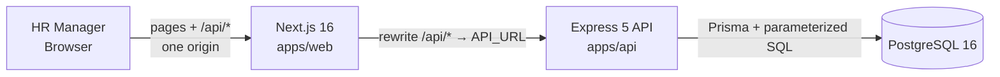
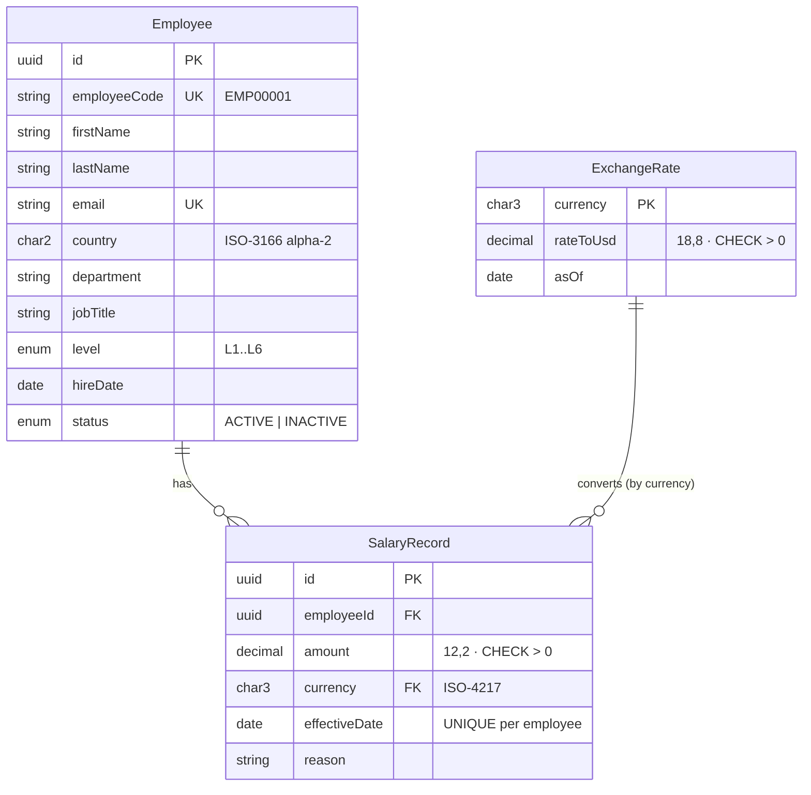

# Architecture & Design Notes

## Overview



**Monorepo** (npm workspaces):
```
apps/api   → Express 5 + TypeScript + Prisma 6 + zod 4
apps/web   → Next.js 16 (App Router) + shadcn/ui + TanStack Query + Recharts
docs/      → requirements, architecture, AI usage log
```

### Why a separate backend (not Next.js API routes)?
Clear separation between domain/API and UI, independently testable, and matches
the brief's "backend & UI" framing. Cost: two deployables — acceptable.

### Why Next.js proxies `/api` instead of the browser calling the API directly
Web and API are deployed to different hosts. Calling the API cross-site would need
`SameSite=None` cookies, which browsers increasingly block. With a Next.js rewrite
the browser only ever talks to one origin, so a plain `httpOnly; SameSite=Lax`
cookie works and no CORS preflights are needed.

### API layering
```
routes  (HTTP only: parse with zod, call service, send JSON)
  → services  (use cases, Prisma queries, transactions)
    → domain  (pure functions: money, dates, salary rules, reference data)
```
Domain code has no Express or database imports, so it is unit-tested in milliseconds.

## Data model



### Key decisions
| Decision | Reasoning |
|---|---|
| Salary as **append-only history** | HR must answer "when did X last get a raise?"; overwriting loses data. Current salary = latest record with `effectiveDate <= today`, so **future-dated raises** work for free. |
| One salary record per employee per date (unique) | Makes "current salary" unambiguous. |
| Store **local currency**, convert at query time | Source of truth stays as HR entered it; USD is a derived view. |
| **Currency derived from country**, never sent by the client | Removes a whole class of data-entry mistakes (an Indian employee paid in GBP). |
| Salary currency is a **foreign key** to `exchange_rates` | Every salary is guaranteed convertible; the dashboard can never silently drop rows. |
| **Fixed exchange-rate table** | Reproducible reports, deterministic tests. Rates are data, updatable without a deploy. |
| `Decimal` for money, never float | Avoids rounding drift in totals; JSON numbers only at the API boundary. |
| Dates as `YYYY-MM-DD` strings in domain code | Postgres `DATE` is a calendar date; strings can't be shifted by server timezone. |
| **Analytics in SQL** (`DISTINCT ON`, `percentile_cont`) | 10k employees aggregate in the DB; only summary rows cross the wire. |
| Soft delete (`status = INACTIVE`) | Salary history is an audit trail; deactivated staff are excluded from insights. |
| `CHECK` constraints in a hand-written migration | Defense in depth: the DB rejects non-positive salaries even if the API is bypassed. |

### Indexes
- `employees(country)`, `(department)`, `(job_title, level)`, `(status)`, `(last_name, first_name)` — directory filters and default sort
- `salary_records(employee_id, effective_date)` UNIQUE — also serves the latest-salary lookup
- `employees(employee_code)`, `(email)` UNIQUE

## API
All routes except `/health` and `/api/auth/login|logout` require the session cookie.
Errors always look like `{ "error": { "message": "...", "details"?: [...] } }`:
400 validation · 401 not signed in · 404 not found · 409 duplicate · 422 business rule.

| Method | Path | Purpose |
|---|---|---|
| POST | `/api/auth/login` · `/api/auth/logout` | Single-user session (rate-limited login) |
| GET | `/api/auth/me` | Current user |
| GET | `/api/meta` | Countries (+currency), departments → job titles, levels |
| GET | `/api/employees?search&country&department&jobTitle&level&status&page&pageSize&sortBy&sortDir` | Paginated directory with current salary |
| POST | `/api/employees` | Create with starting salary; code auto-assigned |
| GET / PATCH | `/api/employees/:id` | Detail with full salary history / edit profile |
| POST | `/api/employees/:id/deactivate` · `/reactivate` | Soft delete / restore |
| GET / POST | `/api/employees/:id/salaries` | History / record a change (incl. scheduled) |
| GET | `/api/insights/summary?country&department&jobTitle&level` | Headcount, payroll, min/P25/median/P75/max/avg (USD) |
| GET | `/api/insights/breakdown?groupBy=country\|department\|jobTitle\|level\|role&…filters` | Same stats per group |

**Why one `breakdown` endpoint** (the first draft had `/by-country`, `/by-department`, `/by-role`):
the questions HR asks are combinations ("median by level, for Engineering in India").
A whitelisted `groupBy` plus filters answers all of them with one tested query.
Group columns come from a fixed map — user input never becomes SQL; filter values are parameters.

## Auth
Single HR user. `ADMIN_EMAIL` + bcrypt `ADMIN_PASSWORD_HASH` + `JWT_SECRET` from env,
validated at startup (the app refuses to boot with a weak secret).
- JWT (HS256, 8h) in an `httpOnly`, `SameSite=Lax`, `Secure` (prod) cookie
- bcrypt runs even for a wrong email, and both failures return the same message (no account enumeration)
- Login rate limit: 20 attempts / 15 min per IP
- `?next=` after login is validated to stay on this site (no open redirect)
- Next.js `proxy.ts` redirects signed-out users to `/login` (UX only — the API enforces auth)

Known production gaps: no user management, roles, MFA or audit log of who changed what.

## Frontend
- **Insights** (home): KPI tiles + one "pay explorer" (group-by + filters in one row) →
  single-series median bar chart (tooltip shows P25–P75, range, headcount) + full statistics table.
  Chart colour validated for contrast in light and dark mode; the table is the non-visual view.
- **Employees**: search, filters, sort and page live in the URL (shareable, back-button safe);
  debounced search; server-side pagination.
- **Employee detail**: current salary (local + USD), history with % change and scheduled raises,
  **peer comparison** (same title, level, country — reuses the summary endpoint), edit,
  record salary change with a live % preview, confirm-before-deactivate.

## Performance (measured locally, 10,000 employees / 56,216 salary records)
| Operation | Time |
|---|---|
| Seed 10k employees + history (batched `createMany`, one transaction) | ~9–14 s |
| Directory page, filtered / sorted | 15–20 ms |
| Directory free-text search (`ILIKE` across 4 columns) | ~80 ms |
| Insights summary / breakdown | 75–95 ms |

All well under the 300 ms target. Next steps if data grew 10–100×:
`pg_trgm` GIN index for search; a materialized "current salary" view refreshed on write
instead of `DISTINCT ON` per query.

**Production issue found and fixed:** Node's 5 s `keepAliveTimeout` let the API close a
pooled socket just as the Next.js proxy reused it → intermittent `ECONNRESET` / 500.
The server now keeps sockets for 65 s (longer than upstream proxies / load balancers).

## Testing strategy
| Layer | Tool | What |
|---|---|---|
| Domain unit | Vitest | money conversion & rounding, % change, timezone-safe dates, current-salary rules, salary-change validation, reference-data integrity, seed generator determinism |
| API integration | Vitest + Supertest + real Postgres | every endpoint, validation, auth (forged/expired tokens), business rules, and **hand-computed percentiles** for insights |
| Web unit | Vitest | open-redirect guard, currency/date formatting |

- Integration tests use a separate `salary_test` database; the reset helper refuses to run against any DB not ending in `_test`.
- Fixtures are small and hand-built so expected values are obvious; the 10k seed is never used in assertions.
- CI (GitHub Actions) runs typecheck, lint and all tests against a Postgres service container.
