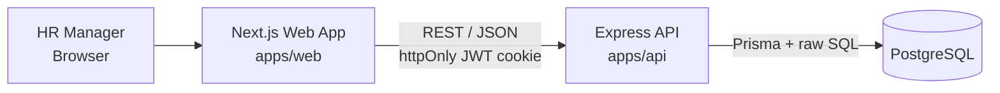
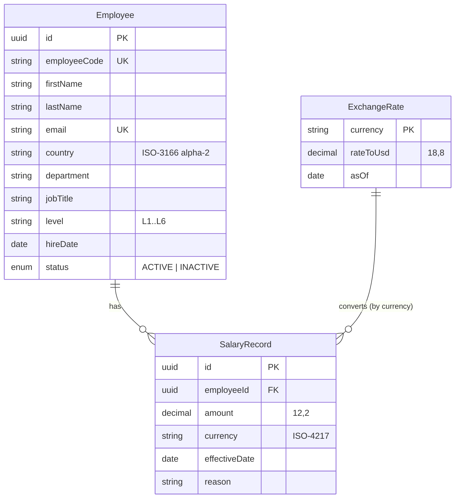

# Architecture & Design Notes

## Overview



**Monorepo** (npm workspaces):
```
apps/api   → Express + TypeScript + Prisma
apps/web   → Next.js (App Router) + shadcn/ui
docs/      → requirements, architecture, AI prompt log
```

## Why a separate backend (not Next.js API routes)?
Clear separation between domain/API and UI, independently testable, and matches
the brief's "backend & UI" framing. Cost: two deployables — acceptable.

## Data model



### Key decisions
| Decision | Reasoning |
|---|---|
| Salary as **append-only history** | HR must answer "when did X last get a raise?"; overwriting loses data. Current salary = latest record with `effectiveDate <= today`. |
| Store **local currency**, convert at query time | Source of truth stays as HR entered it; USD is a derived view. |
| **Fixed exchange-rate table** | Reproducible reports, deterministic tests. Rates can be updated as data, not code. |
| `Decimal` for money, never float | Avoids rounding errors in totals. |
| **Analytics in SQL** (`percentile_cont`, `GROUP BY`) | 10k rows aggregated in the DB in ms; never ship all rows to the browser. |
| Soft delete (`status = INACTIVE`) | Salary history is an audit trail; hard deletes lose it. |

### Indexes
- `Employee(country)`, `Employee(department)`, `Employee(jobTitle)`, `Employee(status)`
- `SalaryRecord(employeeId, effectiveDate DESC)` — fast "current salary" lookup

## API (v1)
| Method | Path | Purpose |
|---|---|---|
| POST | `/api/auth/login` · `/api/auth/logout` | Single-user session |
| GET | `/api/auth/me` | Session check |
| GET | `/api/employees?search=&country=&department=&page=&pageSize=&sort=` | Paginated directory |
| POST | `/api/employees` | Create (with initial salary) |
| GET / PATCH | `/api/employees/:id` | View / edit |
| POST | `/api/employees/:id/deactivate` | Soft delete |
| GET / POST | `/api/employees/:id/salaries` | History / add salary change |
| GET | `/api/insights/summary` | Headcount, total payroll (USD) |
| GET | `/api/insights/by-country` · `/by-department` | Breakdowns |
| GET | `/api/insights/by-role?jobTitle=&level=` | Min/median/avg/max, P25–P75 |
| GET | `/api/meta/filters` | Distinct countries/departments/titles for dropdowns |

## Auth
Single HR user. Credentials from env (`ADMIN_EMAIL`, `ADMIN_PASSWORD_HASH` — bcrypt).
JWT stored in an httpOnly, SameSite cookie. Documented production gap: no user
management, no MFA.

## Testing strategy
- **Unit (Vitest):** currency conversion, statistics helpers, input validation (zod schemas).
- **API (Supertest):** key endpoints against a test database with small hand-written fixtures.
- Seed data (10k) is for demo/perf only — never used in assertions.
