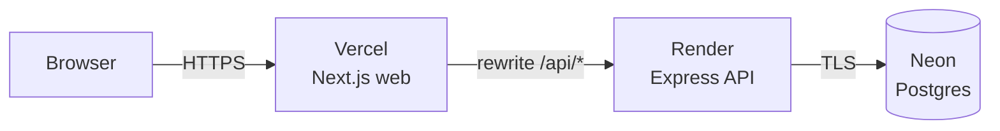

# Deployment



| Part | Host | Plan | Config |
|---|---|---|---|
| Database | Neon (AWS Singapore) | Free | — |
| API | Render (Singapore) | Free | [`render.yaml`](../render.yaml) |
| Web | Vercel | Hobby | Root directory `apps/web`, env `API_URL` |

All three sit in or near Singapore, close to the users and close to each other.

## 1. Database (Neon)
1. Create a project: Postgres 16+, region **AWS Asia Pacific (Singapore)**.
2. Copy the **direct** connection string (turn *Connection pooling* off). It ends in `?sslmode=require`.
3. Save it locally in `apps/api/.env.production` (git-ignored, never committed):
   ```
   DATABASE_URL="postgresql://...neon.tech/neondb?sslmode=require"
   ```
4. Create the tables and load demo data from your machine:
   ```powershell
   cd apps/api
   $env:DATABASE_URL = (Get-Content .env.production | Select-String '^DATABASE_URL=').Line.Split('=',2)[1].Trim('"')
   npx prisma migrate deploy
   $env:NODE_ENV = "production"; $env:SEED_ALLOW_PRODUCTION = "true"
   npm run db:seed
   Remove-Item Env:DATABASE_URL, Env:NODE_ENV, Env:SEED_ALLOW_PRODUCTION
   ```
   The seed refuses to wipe a production database unless `SEED_ALLOW_PRODUCTION=true` is set.

## 2. API (Render)
1. Pick the production password and hash it locally (don't reuse the dev one):
   ```
   npm run hash-password -w apps/api -- "<production password>"
   ```
2. Render → **New → Blueprint** → choose this repo. It reads `render.yaml`.
3. Fill in the prompted values:
   | Key | Value |
   |---|---|
   | `DATABASE_URL` | Neon direct connection string |
   | `ADMIN_EMAIL` | the HR login email |
   | `ADMIN_PASSWORD_HASH` | output of step 1 |
   | `CORS_ORIGIN` | your Vercel URL (use a placeholder now, fix after step 3) |

   `JWT_SECRET` is generated by Render.
4. Wait for the deploy, then open `https://<service>.onrender.com/health`, which should return `{"status":"ok"}`.

Notes:
- Migrations run in the **build** step (`prisma migrate deploy`), since pre-deploy commands need a paid plan.
- The build uses `npm ci --include=dev`: Render sets `NODE_ENV=production`, which would otherwise skip TypeScript and the Prisma CLI.
- The free plan **sleeps after ~15 min idle**; the first request then takes ~30–50 s. Open the app once before a demo.

## 3. Web (Vercel)
1. Vercel → **Add New → Project** → import this repo.
2. **Root Directory:** `apps/web` (framework preset: Next.js).
3. Environment variable: `API_URL` = `https://<service>.onrender.com` (no trailing slash).
   It's read at **build time** (it becomes the `/api` rewrite), so redeploy after changing it.
4. Deploy, then put the final Vercel URL into Render's `CORS_ORIGIN`.

## 4. Smoke test
- `https://<vercel-url>/employees` → redirects to `/login`
- Sign in → the Insights dashboard shows 9,669 active employees across 10 countries
- Record a salary change on any employee → it appears in history and the dashboard updates

## Production notes
- The session cookie is `Secure` + `httpOnly` + `SameSite=Lax`, set on the Vercel domain through the rewrite, so no cross-site cookies are involved.
- Login rate limiting keys on the client IP as seen by Render. Because requests arrive through Vercel's proxy,
  all users share one bucket (20 attempts / 15 min). That's acceptable for a single HR account and is documented as a limitation.
